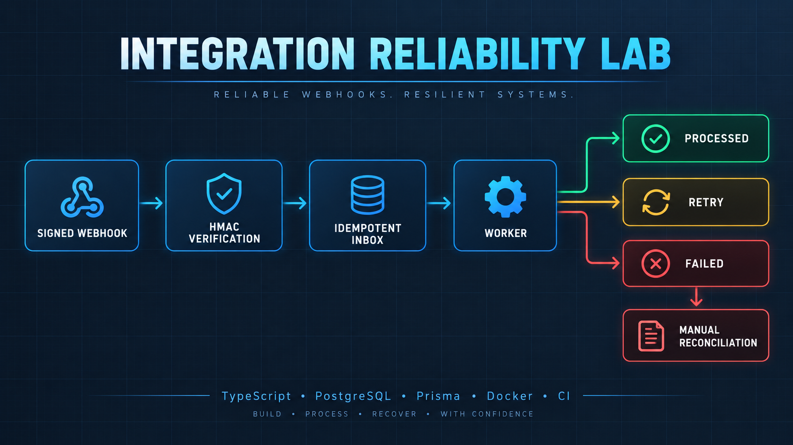
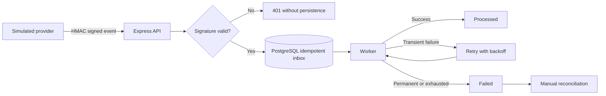

# Integration Reliability Lab

A small, production-minded reference implementation for reliable webhooks: HMAC verification, idempotent ingestion, asynchronous processing, bounded retries, manual reconciliation, and safe operational visibility.

The scenario is entirely synthetic. It does not connect to a payment gateway, move money, or use personal data.



## Why this project exists

Webhook failures are rarely just HTTP problems. Providers retry deliveries, events arrive more than once, transient dependencies fail, and operators need to know exactly what happened without exposing the original payload in logs or status APIs.

This project demonstrates a maintainable baseline for that workflow.



## Behavior

- Invalid signatures return `401` and are never persisted.
- The provider event ID is unique, so retries cannot produce a second effect.
- Valid new events return `202`; duplicate deliveries return `200` with `duplicate: true`.
- Transient failures use bounded exponential backoff.
- Permanent failures and exhausted retries become observable `FAILED` events.
- Manual reconciliation can requeue a failed event.
- Status responses expose state and attempt history, never the stored payload.
- Sensitive request headers are redacted from structured logs.

## Stack

- Node.js 22, TypeScript, Express
- PostgreSQL and Prisma
- Vitest and Supertest
- Docker Compose
- OpenAPI 3.1
- GitHub Actions

## Quick start with Docker

```bash
docker compose up --build
```

The API becomes available at `http://localhost:3000`, and the worker runs as a separate service.

Send a signed sample event:

```bash
node scripts/send-example.mjs examples/payment-success.json
```

Inspect the event without exposing its payload:

```bash
curl http://localhost:3000/events/evt_demo_success_001
```

Run the transient-failure example to observe retry and recovery:

```bash
node scripts/send-example.mjs examples/payment-transient-failure.json
```

## Local development

Start only PostgreSQL:

```bash
docker compose up -d db
```

Copy `.env.example` to `.env`, then run:

```bash
npm ci
npm run prisma:generate
npm run db:deploy
npm run dev
```

In another terminal:

```bash
npm run worker
```

## Validation

```bash
npm run lint
npm run typecheck
npm test
npm run build
```

The integration tests require the PostgreSQL test database configured by `DATABASE_URL`. CI provisions it automatically.

The local reference stack was also exercised end to end: a signed event returned `202`, the same delivery returned `200` with `duplicate: true`, and the worker recorded one successful effect. A simulated transient failure was retried once and then reached `PROCESSED` with both attempts visible in the status API.

## API contract

The OpenAPI document is in [`docs/openapi.yaml`](docs/openapi.yaml). The main routes are:

- `POST /webhooks/provider`
- `GET /events/:providerEventId`
- `POST /internal/process-pending`
- `POST /internal/events/:providerEventId/retry`
- `GET /health`

Internal routes require `x-admin-token`. Development values in the examples are intentionally synthetic and must be replaced outside local environments.

## Design decisions

- **Database-backed inbox:** the unique provider ID is the idempotency boundary.
- **Raw-body verification:** the HMAC is checked against the exact bytes received before validation or persistence.
- **Explicit processing states:** operational state is queryable without reading logs.
- **Claim-before-work:** a conditional update prevents two workers from processing the same event simultaneously.
- **Bounded retries:** retryable failures stop after an explicit limit.
- **Safe observability:** logs contain identifiers and error codes, not the full payload or secrets.

## Scope

This repository is a portfolio case and engineering reference, not a drop-in payment system. Production adoption would additionally require provider-specific replay windows, secret rotation, authentication and authorization design, retention rules, monitoring, alerting, backup policy, and load testing based on real requirements.
